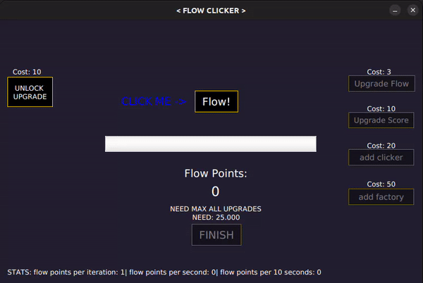

<h1 align="center">Flow Clicker🎯</h1>

**
Se consiste em um simples clicker feito em java.
**

<h2>O jogo:</h2>

**•É um jogo simples(inspirado em hacker simulator) em que o jogador... clica.**

**•Como jogar:**

-baixe o arquivo flowclicker.jar deste repositório

-abra o arquivo jar com clique duplo

-enjoy it ;)

<h3>Tecnologias utilizadas:</h3>

`-Java`

`-JavaFX`

`-Apache Maven`

`-CSS`

`-Eclipse`
